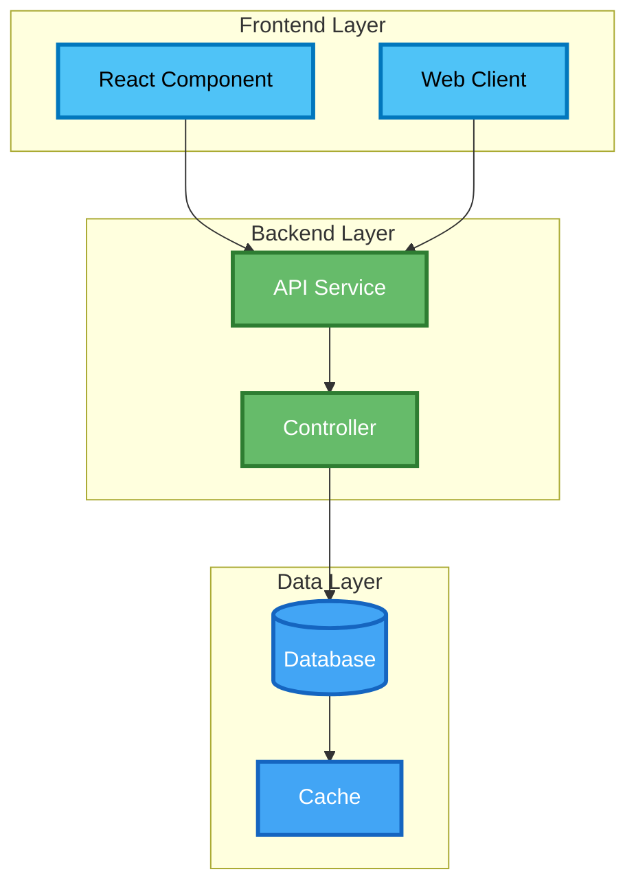

# Journey-Based Blog Framework

## Overview

This document outlines the comprehensive framework for organizing blog content around **learning journeys** that showcase both feature development and architectural thinking. The framework supports flexible content types while maintaining journey continuity and professional presentation.

## Core Philosophy

- **Journey-Focused**: Each project is a learning journey with multiple phases
- **Flexible Content Types**: Support both feature enhancements AND architectural documentation
- **Professional Showcase**: Demonstrate both implementation skills and architectural thinking
- **Continuous Evolution**: Projects grow and evolve over time with new features and architectural insights
- **Context Preservation**: Maintain clear progression and relationships between related posts

## Content Types

### Primary Content Types

```yaml
content_types:
  - "feature-enhancement"      # New functionality, improvements, iterations
  - "architecture-analysis"    # System architecture deep-dives and analysis
  - "infrastructure-design"   # Infrastructure architecture and deployment
  - "service-documentation"   # Specific service details and design
  - "integration-patterns"    # How services and components connect
  - "performance-analysis"    # Performance architecture and optimization
  - "security-design"         # Security architecture and implementation
  - "deployment-strategy"     # Deployment and DevOps architecture
  - "troubleshooting"         # Problem-solving and debugging posts
  - "lessons-learned"         # Retrospectives and learning insights
  - "technology-evolution"    # Technology stack changes and migrations
  - "business-alignment"      # Business requirements and value realization
```

### Content Type Examples

#### Feature Enhancement
- "Adding Real-time Notifications to Tenant Management App"
- "Implementing Advanced Search and Filtering"
- "Building Mobile-Responsive Dashboard"

#### Architecture Analysis
- "Tenant Management System: Microservices Architecture Deep-Dive"
- "API Design Patterns and Best Practices"
- "Database Architecture and Data Modeling"

#### Service Documentation
- "Property Management Service: Detailed Architecture"
- "Payment Processing Service Design"
- "Notification Service Implementation"

#### Infrastructure Design
- "Cloud Infrastructure Architecture for Tenant Management"
- "CI/CD Pipeline Design and Implementation"
- "Monitoring and Observability Strategy"

## Journey Structure

### Project Journey Phases

Each project follows a flexible phase structure:

```
Project: [Project Name]
├── Phase 1: Foundation & Initial Implementation
│   ├── Business requirements analysis
│   ├── Initial architecture design
│   └── MVP implementation
├── Phase 2: Architecture Evolution
│   ├── System architecture improvements
│   ├── Service decomposition
│   └── Integration patterns
├── Phase 3: Advanced Features
│   ├── Feature enhancements
│   ├── Performance optimization
│   └── User experience improvements
├── Phase 4: Production Readiness
│   ├── Infrastructure design
│   ├── Security implementation
│   └── Deployment strategy
└── Phase 5: Continuous Improvement
    ├── Monitoring and observability
    ├── Performance tuning
    └── Future roadmap
```

### Journey Navigation

Each post includes navigation to maintain journey continuity:

```markdown
## 🚀 Journey Navigation
- **Previous**: [Previous Phase/Post Title →](/link-to-previous/)
- **Current**: [Current Post Title]
- **Next**: [Next Phase/Post Title →](/link-to-next/)
```

## Frontmatter Schema

### Standard Frontmatter

```yaml
---
# Standard Jekyll metadata
title: "Post Title"
date: 2025-10-01
categories: [Learning, Architecture, System Design]
tags: [microservices, architecture, system-design, api-design]

# Journey metadata
project: "tenant-management-app"
journey_phase: "architecture-documentation"
journey_step: 3
content_type: "architecture-analysis"

# Navigation
previous_post: "/learning/full-stack%20development/python/tenant-management-modular-evolution/"
next_post: "/learning/infrastructure/tenant-management-deployment-strategy/"

# Optional: Additional context
learning_focus: ["microservices", "api-design", "service-decomposition"]
stakeholders: ["developers", "architects", "operations"]
---
```

### Frontmatter Fields Explained

- **project**: Unique identifier for the project journey
- **journey_phase**: Current phase in the project journey
- **journey_step**: Sequential step number within the journey
- **content_type**: Type of content (from content types list)
- **previous_post/next_post**: Navigation links for journey continuity
- **learning_focus**: Key learning areas covered in the post
- **stakeholders**: Target audience for the content

## Project Showcase Structure

### Enhanced Projects Page

```markdown
## 🏗️ Learning Journeys

### 🔹 [Project Name] Journey
**Brief description of the project and its learning focus**

**Journey Timeline:**
- **Phase 1** (Date): [Foundation →](/link/) *(Feature)*
- **Phase 2** (Date): [Architecture Evolution →](/link/) *(Enhancement)*
- **Architecture** (Date): [System Design →](/link/) *(Architecture)*
- **Service Details** (Date): [Service Architecture →](/link/) *(Service)*
- **Infrastructure** (Date): [Deployment Strategy →](/link/) *(Infrastructure)*
- **Next Phase** (Planned): [Future Enhancement →](/link/) *(Feature)*

**Content Types Covered:**
- ✅ Feature Development
- ✅ Architecture Analysis
- ✅ Service Documentation
- ✅ Infrastructure Design
- 🚧 Security Architecture
- 🚧 Performance Optimization

**Current Status**: 🚧 In Progress (Phase X Complete)
**Tech Evolution**: [Technology progression over time]
**Learning Focus**: [Key learning areas demonstrated]
```

### Journey Index Page

Create `/learning/journeys/` for comprehensive journey overview:

```markdown
# Learning Journeys

## 🏗️ Active Journeys

### Tenant Management App
- **Started**: October 2025
- **Status**: In Progress (Phase 3/5)
- **Latest**: [Microservices Architecture →](/link/)
- **Timeline**: [View Complete Journey →](/projects/#tenant-management-journey)

### Portfolio Website
- **Started**: September 2025
- **Status**: Continuous Improvement
- **Latest**: [Performance Optimization →](/link/)

## 🎯 Completed Journeys
[Show finished projects with final outcomes and lessons learned]
```

## Content Templates

### Architecture Analysis Post Template

```markdown
---
title: "[Project Name]: [Architecture Aspect] Analysis"
date: 2025-10-01
categories: [Learning, Architecture, System Design]
tags: [architecture, system-design, microservices]
project: "project-name"
journey_phase: "architecture-documentation"
content_type: "architecture-analysis"
previous_post: "/link-to-previous/"
next_post: "/link-to-next/"
---

## 🏗️ [Architecture Aspect] Analysis

Building on our [previous phase](/link-to-previous/), let's dive deep into the [architecture aspect]...

### Architecture Overview
[High-level system diagrams, component relationships, data flow]

### Design Decisions
[Key architectural decisions, rationale, trade-offs]

### Implementation Details
[Technical implementation, patterns used, best practices]

### Integration Points
[How this architecture integrates with other systems]

## 🚀 Journey Navigation
- **Previous**: [Previous Phase →](/link-to-previous/)
- **Current**: [Current Architecture Analysis]
- **Next**: [Next Phase →](/link-to-next/)
```

### Service Documentation Post Template

```markdown
---
title: "[Service Name]: Detailed Architecture"
date: 2025-10-01
categories: [Learning, Architecture, Service Design]
tags: [service-architecture, api-design, domain-modeling]
project: "project-name"
journey_phase: "service-documentation"
content_type: "service-documentation"
---

## 🏠 [Service Name] Architecture

A comprehensive look at the [Service Name] design and implementation...

### Service Responsibilities
[What this service does, boundaries, responsibilities]

### API Design
[Endpoints, request/response models, error handling]

### Data Model
[Database schema, relationships, constraints]

### Integration Points
[How it connects with other services and systems]

### Performance Considerations
[Scalability, performance optimizations, monitoring]
```

### Infrastructure Design Post Template

```markdown
---
title: "[Project Name]: Infrastructure Architecture"
date: 2025-10-01
categories: [Learning, Infrastructure, Cloud Architecture]
tags: [aws, cloud-architecture, infrastructure, deployment]
project: "project-name"
journey_phase: "infrastructure-design"
content_type: "infrastructure-design"
---

## ☁️ Infrastructure Architecture

How we designed the infrastructure for the [Project Name]...

### Infrastructure Requirements
[Scalability, availability, security requirements]

### Architecture Components
[Application tier, data tier, integration tier, security tier]

### Deployment Strategy
[CI/CD pipeline, environment management, rollback strategy]

### Monitoring and Observability
[Logging, metrics, alerting, troubleshooting]
```

## Implementation Guidelines

### Phase 1: Foundation Setup
1. **Update Jekyll Configuration**
   - Add content type categories to `_config.yml`
   - Create journey-specific collections if needed
   - Set up navigation helpers

2. **Enhance Current Posts**
   - Add journey metadata to existing posts
   - Create journey navigation between related posts
   - Add content type classification

### Phase 2: Content Structure
1. **Create Journey Index**
   - `/learning/journeys/` page for journey overview
   - Project-specific journey pages
   - Content type filtering and discovery

2. **Enhance Projects Page**
   - Add journey timelines with content type indicators
   - Show project progression and current status
   - Highlight architectural decisions and learning outcomes

### Phase 3: Content Expansion
1. **Architectural Documentation**
   - System architecture analysis posts
   - Service-specific documentation
   - Infrastructure design posts

2. **Journey Continuity**
   - Ensure smooth navigation between related posts
   - Maintain consistent metadata across journey posts
   - Add cross-references and related content

## Benefits of This Approach

### For Content Creation
- **Flexible Content Types**: Support any type of technical content
- **Journey Continuity**: Clear progression and relationships
- **Professional Presentation**: Showcase both implementation and architectural skills
- **Easy Navigation**: Readers can follow complete learning journeys

### For Audience
- **Comprehensive Learning**: Complete picture of project evolution
- **Architectural Insights**: Deep understanding of design decisions
- **Practical Application**: Real-world examples of architectural thinking
- **Professional Development**: Demonstrates enterprise-level skills

### For SEO and Discovery
- **Rich Content**: Multiple content types increase search visibility
- **Internal Linking**: Strong internal link structure
- **Topic Clusters**: Related content grouped by project journeys
- **Long-form Content**: Detailed posts perform better in search

## Future Enhancements

### Advanced Features
- **Interactive Diagrams**: Mermaid diagrams for architecture visualization
- **Content Filtering**: Filter by content type, project, or phase
- **Journey Metrics**: Track journey progression and completion
- **Related Content**: Automatic suggestions for related posts

### Analytics and Insights
- **Journey Completion Rates**: Track which journeys are most engaging
- **Content Type Performance**: Understand which content types perform best
- **Reader Journey Mapping**: See how readers navigate through content
- **Learning Outcome Tracking**: Measure knowledge transfer and engagement

## Maintenance Guidelines

### Regular Updates
- **Journey Status**: Keep project status and phase information current
- **Navigation Links**: Ensure all journey navigation links work correctly
- **Content Classification**: Consistently apply content types and metadata
- **Cross-References**: Maintain links between related posts

### Content Quality
- **Consistent Structure**: Follow templates and guidelines
- **Clear Navigation**: Make it easy for readers to follow journeys
- **Rich Metadata**: Include comprehensive frontmatter for all posts
- **Visual Elements**: Use diagrams and visual aids to enhance understanding

---

## Quick Reference

### Content Type Quick Guide
- **Feature Enhancement**: New functionality, improvements, iterations
- **Architecture Analysis**: System design, architectural decisions, patterns
- **Service Documentation**: Specific service details, API design, implementation
- **Infrastructure Design**: Cloud architecture, deployment, DevOps
- **Integration Patterns**: How components connect, communication patterns
- **Performance Analysis**: Optimization, scalability, monitoring
- **Security Design**: Security architecture, implementation, best practices
- **Deployment Strategy**: CI/CD, environment management, rollback
- **Troubleshooting**: Problem-solving, debugging, lessons learned
- **Lessons Learned**: Retrospectives, insights, future improvements

### Journey Phase Examples
- **Foundation**: Initial implementation, MVP, basic architecture
- **Architecture Evolution**: System improvements, service decomposition
- **Advanced Features**: New functionality, user experience improvements
- **Production Readiness**: Infrastructure, security, deployment
- **Continuous Improvement**: Monitoring, optimization, future roadmap

This framework provides a comprehensive foundation for organizing technical content around learning journeys while maintaining flexibility for different types of architectural and implementation documentation.

## Mermaid Diagram Color Palette

When creating Mermaid diagrams in blog posts, use the following modern color palette with `classDef` styling for consistency and visual distinction:

### Color Palette Definitions:

| Component Type | Color | Stroke | Usage |
|---|---|---|---|
| **Frontend/Client** | `#4fc3f7` (Light Blue) | `#0277bd` (Dark Blue) | React components, web clients |
| **Backend/API** | `#66bb6a` (Green) | `#2e7d32` (Dark Green) | Spring Boot, controllers, services |
| **Database** | `#42a5f5` (Blue) | `#1565c0` (Dark Blue) | PostgreSQL, H2, data layer |
| **Infrastructure** | `#ff7043` (Orange) | `#d84315` (Dark Orange) | Docker, containers, infrastructure |
| **External Services** | `#ab47bc` (Purple) | `#6a1b9a` (Dark Purple) | Swagger, monitoring, external APIs |
| **Security** | `#ffcdd2` (Light Red) | `#d32f2f` (Dark Red) | Security components, authentication |
| **Performance** | `#c8e6c9` (Light Green) | `#388e3c` (Green) | Caching, optimization |
| **Testing** | `#e1bee7` (Light Purple) | `#8e24aa` (Purple) | Test components, validation |
| **Monitoring** | `#b3e5fc` (Light Blue) | `#0288d1` (Blue) | Health checks, metrics |
| **Documentation** | `#ffa726` (Orange) | `#ef6c00` (Dark Orange) | API docs, specifications |

### Usage Guidelines:
- **Frontend/Client**: Use for React components, web applications, user interfaces
- **Backend/API**: Use for server-side services, API endpoints, business logic
- **Database**: Use for data storage, databases, data persistence layers
- **Infrastructure**: Use for deployment, containers, infrastructure components
- **External Services**: Use for third-party integrations, external APIs
- **Security**: Use for authentication, authorization, security components
- **Performance**: Use for caching, optimization, performance-related components
- **Testing**: Use for test components, validation, quality assurance
- **Monitoring**: Use for observability, health checks, metrics collection
- **Documentation**: Use for API documentation, specifications, guides

### Mermaid classDef Styling Template:



### Implementation Notes:
- **Use classDef**: Always use `classDef` styling instead of theme variables for better control
- **Stroke Width**: Use `stroke-width:3px` for better visibility
- **Text Color**: Use `color:#000` for light backgrounds, `color:#fff` for dark backgrounds
- **Class Assignment**: Apply classes using `class ComponentName1,ComponentName2 className`
- **ER Diagrams**: Entity Relationship diagrams don't support classDef, use default styling

## Journey Linking Instructions

When creating new posts in a journey, always verify and update journey navigation:

### 1. **Check Previous Post Links**
- Ensure the previous post's `next_post` field points to your new post
- Update the previous post's `next_post` URL to match your new post's path

### 2. **Set Up New Post Navigation**
- Add proper `previous_post` field pointing to the previous post
- Set `next_post` field if you know the next planned post
- Use `null` for `next_post` if it's the latest post in the journey

### 3. **Update Journey Metadata**
- Ensure `journey_step` is sequential (increment from previous post)
- Verify `journey_phase` is appropriate for the content type
- Set `content_type` to match the post's focus
- Update `learning_focus` to reflect key learning areas

### 4. **Navigation Section Format**
```markdown
## 🚀 Journey Navigation
- **Previous**: [Previous Post Title →](/path-to-previous/)
- **Current**: Current Post Title
- **Next**: [Next Post Title →](/path-to-next/) *(Status)*
```

### 5. **Journey Continuity Checklist**
- [ ] Previous post links to this post
- [ ] This post links to previous post
- [ ] Journey metadata is consistent
- [ ] Navigation section is complete
- [ ] Content references previous journey steps appropriately

### 6. **Update Projects Page**
- [ ] Update journey timeline with new post
- [ ] Update content types covered
- [ ] Update current status and phase
- [ ] Update tech evolution if applicable
- [ ] Update learning focus if new areas covered
- [ ] Verify all links are working correctly

## Projects Page Maintenance

The `_pages/projects.md` file serves as the central hub for all learning journeys and must be updated whenever:

### When to Update Projects Page

**New Post Created:**
- Add new post to journey timeline
- Update content types covered
- Update current status and phase
- Update tech evolution if technology stack changes
- Update learning focus if new learning areas are introduced

**Existing Post Modified:**
- Update post title or description if changed
- Update content type if post focus changes
- Update learning focus if new areas are added
- Verify all links still work correctly

**Journey Phase Changes:**
- Update current status (e.g., "Phase 3 Complete" → "Phase 4 Complete")
- Update tech evolution if architecture changes
- Update learning focus if new skills are demonstrated

### Projects Page Update Checklist

```markdown
## Update Checklist for New Posts

### Journey Timeline Updates
- [ ] Add new post to timeline with correct date
- [ ] Use appropriate content type indicator (Feature, Architecture, Service, etc.)
- [ ] Update post status (Completed, In Progress, Planned)
- [ ] Ensure chronological order is maintained

### Content Types Updates
- [ ] Mark new content types as completed (✅)
- [ ] Keep planned content types as (🚧)
- [ ] Add new content types if introduced

### Status Updates
- [ ] Update current status (e.g., "Phase X Complete")
- [ ] Update tech evolution if applicable
- [ ] Update learning focus with new areas
- [ ] Verify all links are working

### Quality Checks
- [ ] All journey links are functional
- [ ] Content type indicators are accurate
- [ ] Status reflects actual progress
- [ ] Learning focus is comprehensive
```

### Projects Page Structure Guidelines

**Journey Timeline Format:**
```markdown
- **Phase Name** (Date): [Post Title →](/link/) *(Content Type)*
- **Current Status**: 🚧 In Progress (Phase X Complete)
- **Tech Evolution**: Technology progression over time
- **Learning Focus**: Key learning areas demonstrated
```

**Content Type Indicators:**
- *(Feature)* - Feature development, enhancements
- *(Architecture)* - System design, architectural analysis
- *(Service)* - Service-specific documentation
- *(Infrastructure)* - Deployment, infrastructure design
- *(Security)* - Security architecture, implementation
- *(Performance)* - Optimization, performance analysis

**Status Indicators:**
- ✅ Completed content types
- 🚧 Planned content types
- 🔄 In Progress content types

