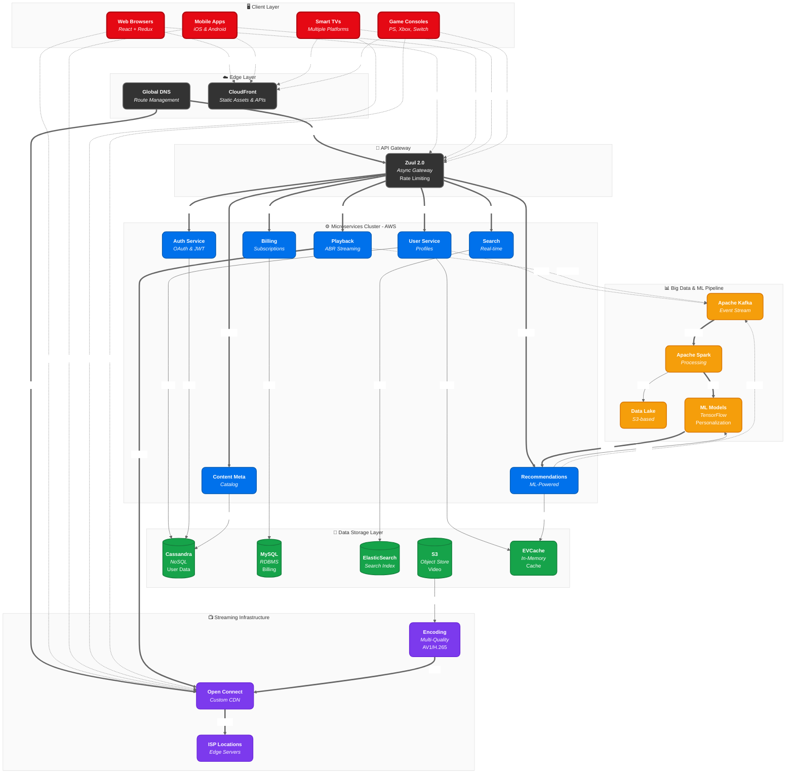
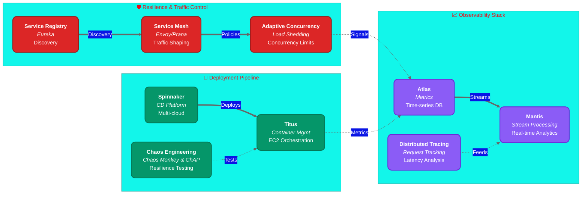

# Netflix Architecture Overview

## High-Level Architecture Diagram

## Detailed Component Architecture

## Architecture Description

### Client Layer
Netflix supports multiple platforms including web browsers, mobile apps (iOS/Android), smart TVs, gaming consoles, and streaming devices. Each client is optimized for its platform while maintaining consistent user experience.

### Edge Layer
**Open Connect** appliances positioned inside partner ISPs carry the bulk of video delivery, while **global DNS** steers devices to the closest healthy edge. **AWS CloudFront** augments this for static assets, images, and some API acceleration rather than serving primary streaming traffic.

### API Gateway
**Zuul** acts as the front door for all requests, handling dynamic routing, monitoring, security, and resilience. It routes requests to appropriate microservices and applies cross-cutting concerns like authentication, rate limiting, and request filtering.

### Microservices Architecture
Netflix pioneered microservices at scale with hundreds of services:
- **User Service**: Manages profiles, preferences, and viewing history
- **Authentication Service**: Handles login, session management, and security
- **Recommendation Engine**: Powers personalized content suggestions using machine learning
- **Search Service**: Provides fast, relevant content discovery
- **Playback Service**: Manages streaming sessions and quality adaptation
- **Billing Service**: Handles subscriptions and payments
- **Content Metadata Service**: Stores information about movies, shows, and episodes

### Data Storage
Netflix uses **polyglot persistence**:
- **Cassandra**: Primary NoSQL database for user data, viewing history, and distributed data requiring high availability
- **MySQL**: Transactional data like billing and subscriptions
- **ElasticSearch**: Powers search functionality with full-text indexing
- **S3**: Stores encoded video content, images, and backups
- **EVCache**: Distributed memcached-based caching layer for performance

### Streaming Infrastructure
**Open Connect** is Netflix's primary CDN with appliances placed in ISP data centers worldwide. Video encoding creates multiple quality versions (4K to mobile) using adaptive bitrate streaming, and content is pre-positioned near users for optimal performance.

### Big Data Pipeline
- **Apache Kafka**: Real-time event streaming for user interactions, playback events, and system metrics
- **Apache Spark**: Batch and stream processing for analytics
- **Hadoop/S3**: Data lake for historical analysis
- **Machine Learning**: Powers recommendations, artwork personalization, encoding optimization, and quality of experience

### Resilience & Reliability
Netflix now emphasizes adaptive protection layers:
- **Adaptive Concurrency Limits**: Load shedding and backpressure replacing legacy Hystrix patterns
- **Service Mesh Policies**: Envoy/Prana filters handle retries, timeouts, and regional failover
- **Service Registry (Eureka)**: Dynamic discovery for hundreds of services
- **Chaos Engineering**: Chaos Monkey and ChAP continuously validate failure tolerance

### Observability
- **Atlas**: Time-series monitoring for metrics across all services
- **Mantis**: Real-time stream processing for operational insights
- **Distributed Tracing**: Tracks requests across microservices

### Deployment
- **Spinnaker**: Multi-cloud continuous delivery platform for safe deployments
- **Titus**: Container management platform orchestrating workloads on Amazon EC2

### Key Characteristics
1. **Global Scale**: Serves 200+ million subscribers across 190+ countries
2. **Cloud-Native**: Runs primarily on AWS with multi-region architecture, complemented by Netflix-owned Open Connect infrastructure
3. **Microservices**: Hundreds of loosely coupled services
4. **API-First**: All functionality exposed through well-defined APIs
5. **Data-Driven**: Every decision backed by A/B testing and analytics
6. **Resilient**: Built to handle failures gracefully with chaos engineering

This architecture enables Netflix to stream billions of hours of content monthly while maintaining high availability and delivering personalized experiences at massive scale.
